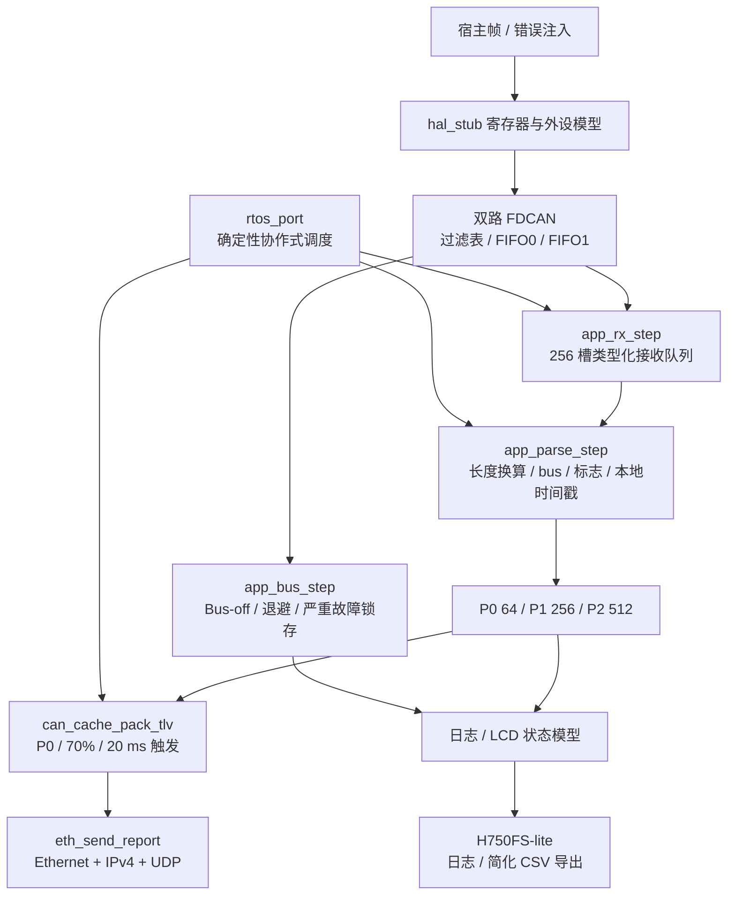

# STM32H750 双路 CAN/CAN FD 数据采集终端

[](https://github.com/xiaoli5201314-spec/stm32h750-can-data-terminal/actions/workflows/ci.yml)

面向工业设备状态采集、告警汇聚与现场诊断的嵌入式 C 项目。
仓库实现了从双路 FDCAN 接收、过滤路由、记录解析、分层缓存到 TLV/UDP 批量上报的应用流水线。
通过可注入的寄存器、内存和外设模型，核心逻辑可以在宿主机上构建、复现异常并运行回归测试。

**技术关键词：** C99、FDCAN、CAN FD、SPSC 环形队列、固定内存池、MPU、D-Cache/DMA 一致性、TLV、IPv4/UDP、故障注入。

本仓库展示项目的 **公开代码与技术文档**，围绕数据采集、缓存调度、协议封装和异常恢复组织工程。
公开内容包含 C 源码、可注入的宿主仿真后端、单元与集成测试，以及模块设计和协议说明。
目标配置采用 STM32H750ZBT6，主机测试入口便于阅读者直接运行并跟踪数据流。

## 快速了解

| 项目 | 内容 |
| --- | --- |
| 业务定位 | 将不同 CAN 总线上的周期状态、关键告警和观测数据汇聚为统一上报记录 |
| 已实现主链路 | 接收 FIFO → 类型化队列 → 解析 → P0/P1/P2 缓存 → TLV → UDP 帧组包 |
| 可运行入口 | `make -C firmware -B test` |
| 2026-10-03 主机验证 | 14 个套件、11812 项检查、0 失败；ASan/UBSan 通过 |
| 集成场景记录 | 240 条记录、20 个上报包、8960 字节 TLV 数据 |
| 过滤路由表 | 33 个表驱动用例，另有 GFC 编码及嗅探切换断言 |
| 测试方式 | 寄存器与外设模型、双总线帧注入、故障注入、流水线回归 |

执行环境、命令和结果见 [验证记录](docs/VERIFICATION.md)。

## 业务场景

### 工业设备状态汇聚

- CAN1 的配置分组覆盖伺服/变频器状态、传感器数据、诊断和告警 ID。
- CAN2 的配置分组覆盖高频观测、同步类 ID 和关键告警。
- 同一 CAN ID 可以来自不同总线，记录中的 `bus` 字段保留来源。
- 周期状态与观测数据使用不同缓存配额，便于讨论资源受限时的取舍。
- 过滤规则集中配置，方便按业务 ID 扩展状态、告警和观测分组。

### 告警优先上报

- 业务优先级由 `can_cache_prio_of_id()` 判定。
- 高优先级 P0 非空即请求刷新，不必等待普通周期。
- 普通数据在总水位达到 70% 或 20 ms 周期到期时尝试组包。
- 单次解析最多处理 64 条，避免一个阶段无限占用协作式调度。
- 各层容量、溢出策略和丢弃计数独立管理，便于分析资源占用。

### 现场诊断与问题复现

- 可注入匹配帧、未匹配帧、FIFO 压力和 Bus-off 状态。
- 嗅探开关允许未匹配帧进入 FIFO0，并可恢复正常拒收策略。
- 诊断日志按级别和模块记录事件，支持文本导出。
- LCD 模型展示状态并提供帧缓冲校验、像素和绘制结果检查。
- SD 模型支持日志和离线文本导出，方便复现现场诊断流程。

## 技术亮点与源码证据

### 1. 从应用到外设模型的可测试链路

[`app_main.c`](firmware/src/app_main.c) 用 `app_init()` 装配资源和驱动。
`app_rx_step()`、`app_parse_step()`、`app_report_step()` 分别承担接收、解析和上报。
[`test_system_integration.c`](firmware/test/test_system_integration.c) 通过 `app_inject_frame()` 与 `app_run_ms()` 驱动整条链路。
测试还覆盖心跳、总线恢复、日志导出、暂停上报后的缓存导出和嗅探切换。

### 2. 双实例 FDCAN 与规则化过滤

[`fdcan_driver.c`](firmware/src/fdcan_driver.c) 包含位时序计算、消息 RAM 布局、收发及恢复接口。
[`fdcan_filter.c`](firmware/src/fdcan_filter.c) 实现范围、掩码、双 ID 和扩展 ID 匹配。
规则按照表中顺序首次匹配，分别路由至 FIFO0、FIFO1 或拒收。
GFC 未匹配编码与过滤元素 FEC 编码分别处理，避免把两套编码混用。
运行时嗅探切换经过 INIT/CCE 配置窗口、GFC 写入与回读、原控制器状态恢复。
应用层协调两路切换，在失败时回滚配置并返回错误；软件标志和成功日志在两路成功后更新。

### 3. 完整保留 CAN FD 数据长度与总线来源

`fdcan_frame_payload_bytes()` 统一接收、发送和上报路径的有效负载长度：
CAN FD 使用 DLC 映射，DLC `15` 对应 `64` 字节；Classic CAN 数据帧最多 `8` 字节，RTR 帧为 `0` 字节。
接收队列使用 `app_rxq_item_t` 数组，槽大小由 `sizeof(app_rxq_item_t)` 决定。
每个槽携带帧、接收阶段毫秒值和 `bus`，避免依赖帧 ID 推断总线。
集成测试检查 CAN2 的 64 字节帧在解析后仍保留来源和完整负载。
Classic/RTR 回归覆盖两路总线、全部 DLC 编码、陈旧消息 RAM 与 TLV 长度。

### 4. 有界缓冲与可观测的溢出决策

[`ring_buffer.c`](firmware/src/ring_buffer.c) 提供固定容量 SPSC 队列。
[`can_cache.c`](firmware/src/can_cache.c) 提供 64/256/512 槽三层缓存。
缓存按 P0 → P1 → P2 出队，同层保持 FIFO 顺序。
低优先级满时丢弃新记录，中高优先级满时执行淘汰并更新计数。
三层配额独立；高层溢出时按策略淘汰本层旧记录，并保留统计用于诊断。

### 5. 显式序列化的批量上报协议

`can_cache_pack_tlv()` 按字节写入头部和记录，不直接发送 C 结构体。
8 字节批次头加若干记录 TLV；记录携带 ID、标志、长度、总线、优先级、时间戳和序号。
[`eth_rmii.c`](firmware/src/eth_rmii.c) 进一步构造 Ethernet/IPv4/UDP 帧。
内层 TLV 多字节字段使用小端，外层 IPv4/UDP 字段使用网络字节序。
字段偏移及发送语义见 [协议说明](docs/PROTOCOLS.md)。

### 6. 可复现的 Cache/DMA 一致性问题

[`mpu_config.c`](firmware/src/mpu_config.c) 提供区域表、属性校验和 RBAR/RASR 编码。
[`cache_coherency.c`](firmware/src/cache_coherency.c) 提供 32 字节行对齐与 DMA 同步接口。
宿主影子缓存模型区分非缓存、写穿透和写回行为。
测试可以复现 CPU 与 DMA 读到不同内容，以及 clean/invalidate 后的变化。
模块测试通过影子缓存与 DMA 视图区分缓存维护前后的数据一致性。

### 7. 错误恢复与锁存严重故障

`fdcan_handle_bus_error()` 读取错误状态并进入 Bus-off 处理。
`fdcan_bus_recovery_step()` 按配置的退避时间尝试重入总线。
连续故障达到阈值后设置 `severe_fault`，后续状态变化不会自动解除锁存。
CAN1 或 CAN2 的严重故障均汇入应用层统计和错误 LED。
CAN 发送路径还提供超时与有限重试。
驱动测试覆盖恢复、退避、严重状态与嗅探开关。

## 系统架构



图中展示公开代码的应用流水线与主机测试后端。
详细调用关系、缓存策略、发送流程和故障处理见 [架构说明](docs/ARCHITECTURE.md)。

## 公开模块

| 模块 | 工程内容 | 测试关注点 |
| --- | --- | --- |
| 双路 FDCAN | 位时序、消息 RAM 分区、收发接口 | 两实例配置、FIFO、发送重试 |
| 过滤与嗅探 | 范围、掩码、双 ID、GFC 切换 | 33 个路由用例、配置握手、失败回滚 |
| 帧长度与来源 | CAN FD / Classic / RTR 长度处理，保留总线字段 | 64 字节、DLC 全范围、两路 TLV 往返 |
| 接收队列 | 256 槽类型化 SPSC 队列 | 回绕、满队列、槽宽与完整性 |
| 优先级缓存 | P0/P1/P2 独立容量和统计 | 出队顺序、水位、溢出策略 |
| TLV 与 UDP | 显式序列化、批次号、Ethernet/IPv4/UDP 组包 | 字段布局、负载容量、本地回环 |
| Bus-off 恢复 | 退避状态机、严重故障锁存、全局告警 | 连续故障、恢复次数、CAN2 独立故障 |
| MPU 与 Cache | 区域属性编码、缓存行对齐、DMA 同步 | 影子缓存、clean/invalidate |
| 内存池 | 固定块分配、回收、完整性检查 | 耗尽、重复释放、错误地址 |
| SDRAM / QSPI 模型 | 时序配置、内存自检、页写与回读 | 参数计算、数据比较 |
| 日志与 SD 模型 | 分级日志、H750FS-lite、文本导出 | 环形覆盖、文件读写、掉电模拟 |
| LCD 状态模型 | RGB565 双缓冲、数字与诊断页 | 像素统计、帧缓冲校验 |
| 任务与事件 | 确定性协作式调度、周期任务 | 流水线推进、任务执行记账 |
| 自动回归 | Ubuntu GCC、ASan、UBSan | 推送、PR 和手动触发 |

## 配置速览

以下参数来自 [`h750_config.h`](firmware/include/h750_config.h)，用于工程配置和主机模型。

| 配置 | 数值 |
| --- | --- |
| 时钟配置 | HSE 25 MHz；SYSCLK 480 MHz；HCLK 240 MHz；APB 120 MHz |
| CAN1 目标速率 | 仲裁段 500 kbit/s，数据段 2 Mbit/s |
| CAN2 目标速率 | 仲裁段 1 Mbit/s，数据段 5 Mbit/s |
| FDCAN 目标采样点 | 80%，计算结果由驱动与测试检查 |
| 每实例接收 FIFO | FIFO0 32 元素，FIFO1 16 元素 |
| 接收软件队列 | 256 个 `app_rxq_item_t` 槽 |
| 三层缓存 | P0 64、P1 256、P2 512，共 832 条 |
| 上报条件 | P0 非空、总水位 ≥ 700‰ 或周期到达 20 ms |
| 上报负载上限 | 1400 字节 TLV，非整个以太网帧长度 |
| 外部存储模型 | QSPI 8 MB，SDRAM 32 MB，SD 卡影像 32 MB |
| LCD 模型 | 800×480，RGB565，双缓冲 |
| 日志环容量 | 2048 条 |

当前装载规则为 CAN1 标准 5 条 / 扩展 2 条，CAN2 标准 4 条 / 扩展 2 条。

## 目录导览

| 入口 | 阅读内容 |
| --- | --- |
| [firmware/](firmware/) | 现有 C 工程与测试 |
| [include/](firmware/include/) | 模块公共接口、数据类型与配置 |
| [app_main.c](firmware/src/app_main.c) | 应用装配、五阶段任务与运维动作 |
| [fdcan_driver.c](firmware/src/fdcan_driver.c) | 位时序、消息 RAM、收发和恢复 |
| [fdcan_filter.c](firmware/src/fdcan_filter.c) | 业务 ID 表、匹配语义和寄存器编码 |
| [can_cache.c](firmware/src/can_cache.c) | 优先级、溢出决策与 TLV |
| [ring_buffer.c](firmware/src/ring_buffer.c) | 接收队列与满队列行为 |
| [mem_pool.c](firmware/src/mem_pool.c) | 固定块分配、回收和完整性检查 |
| [mpu_config.c](firmware/src/mpu_config.c) | MPU 区域表及属性编码 |
| [cache_coherency.c](firmware/src/cache_coherency.c) | 缓存维护、影子缓存和 DMA 同步 |
| [eth_rmii.c](firmware/src/eth_rmii.c) | PHY/MDIO 接口、本地发送模型和 UDP 组包 |
| [sd_file.c](firmware/src/sd_file.c) | H750FS-lite 与 SD 块设备模型 |
| [lcd_diag.c](firmware/src/lcd_diag.c) | 双缓冲状态绘制 |
| [diag_log.c](firmware/src/diag_log.c) | 日志级别、事件环和文本导出 |
| [hal/](firmware/hal/) | 寄存器定义与 `H750_PC_SIM` 模型 |
| [test/](firmware/test/) | 单元测试、故障注入与流水线集成测试 |
| [Makefile](firmware/Makefile) | 宿主构建、测试、Sanitizer 和 ARM 对象目标 |
| [platformio.ini](firmware/platformio.ini) | 平台与构建参数参考 |
| [docs/](docs/) | 架构、构建、协议与验证记录 |
| [ci.yml](.github/workflows/ci.yml) | Ubuntu GCC 宿主测试与 Sanitizer 流水线 |

## 源码阅读路线

1. 从 [`app.h`](firmware/include/app.h) 和 `app_init()` 看应用 API 与资源装配。
2. 对照 [`test_system_integration.c`](firmware/test/test_system_integration.c) 跟踪一帧如何被注入、解析和上报。
3. 阅读 `rx_from_instance()` 与 `app_parse_step()`，核对总线来源、DLC 和时间戳产生位置。
4. 阅读 `can_cache_push()`、`can_cache_pop()`，区分优先顺序、独立容量与实际淘汰。
5. 阅读 `can_cache_pack_tlv()` 和 [协议字段表](docs/PROTOCOLS.md)，核对线格式而不是结构体布局。
6. 阅读 `fdcan_filter_route()` 与 [`test_fdcan_filter.c`](firmware/test/test_fdcan_filter.c)，理解默认拒收和嗅探行为。
7. 阅读 `fdcan_handle_bus_error()`、`fdcan_bus_recovery_step()`，核对锁存和退避。
8. 最后阅读 Cache/DMA、外设模型与 [构建说明](docs/BUILD_AND_TEST.md)。

## 快速构建与测试

在仓库根目录使用 Linux 或 WSL 中的 GNU Make 与 GCC：

```bash
# 强制重编译并执行全部宿主测试
make -C firmware -B test CC=gcc

# 使用独立 build-asan 目录执行 ASan + UBSan
make -C firmware -B asan CC=gcc

# 只构建测试程序，不执行
make -C firmware CC=gcc

# 运行测试，并尝试导出过滤路由 CSV
make -C firmware csv CC=gcc
```

测试程序是 `firmware/build/run_tests`，Sanitizer 程序是 `firmware/build-asan/run_tests`。
测试入口默认把过滤表导出到 `firmware/build/filter_routing.csv`。

```bash
# 分别清理普通构建与 Sanitizer 构建
make -C firmware clean
make -C firmware clean BUILD=build-asan

# 可选：交叉编译 ARM 对象
make -C firmware arm ARM_CC=arm-none-eabi-gcc
```

详细依赖、产物目录和构建参数见 [构建与测试](docs/BUILD_AND_TEST.md)。

## 验证摘要

2026-10-03 的执行记录包含以下两个命令：

```bash
make -C firmware -B test CC=gcc
make -C firmware -B asan CC=gcc
```

普通构建与 Sanitizer 构建均为 14 个测试套件、11812 项检查、0 失败，退出码为 0。
ASan/UBSan 运行通过。
混合总线集成场景产生 240 条记录、20 个本地上报包、8960 字节 TLV。
8960 字节为 TLV 应用负载累计。
定向回归、环境和测试记录见 [VERIFICATION.md](docs/VERIFICATION.md)。
远端自动回归状态以首页徽章和 GitHub Actions 的对应提交记录为准；本节记录本地执行结果。

## 文档导航

| 文档 | 内容 |
| --- | --- |
| [架构说明](docs/ARCHITECTURE.md) | 模块调用、任务划分、资源管理和故障处理 |
| [协议说明](docs/PROTOCOLS.md) | CAN 路由、有效负载长度、TLV 字段和网络字节序 |
| [构建与测试](docs/BUILD_AND_TEST.md) | 工具链、构建目标、测试套件和自动回归 |
| [验证记录](docs/VERIFICATION.md) | 执行日期、环境、命令、结果和定向回归 |
