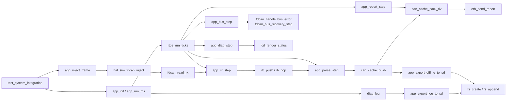

# 架构与实现约束

[返回项目首页](../README.md) · [构建与测试](BUILD_AND_TEST.md) · [协议](PROTOCOLS.md) · [验证记录](VERIFICATION.md)

本文以实际函数实现为准，不将源文件注释中的目标规划视为已交付能力。
当前工程采用 C99、静态资源和阶段化 API，核心流水线通过 `H750_PC_SIM` 后端验证。

## 1. 模块关系

应用层位于 [`app_main.c`](../firmware/src/app_main.c)，公共 API 位于 [`app.h`](../firmware/include/app.h)。
寄存器、物理地址映射、时基和外设注入由 [`hal_stub.c`](../firmware/hal/hal_stub.c) 提供。

## 2. 初始化顺序

`app_init()` 的主要顺序：

1. 清空应用上下文，调用 `board_init()`。
2. 调用 `mpu_configure_all()`、`mpu_enable()`、`cc_init()`。
3. 初始化四类定长池、接收队列、三层缓存和诊断环。
4. 初始化阶段事件以及 SDRAM、QSPI、SD、以太网和 LCD 接口。
5. SD 挂载失败时尝试格式化模型文件系统。
6. 初始化两个 FDCAN 实例、装载过滤规则并启动。
7. 注册五个阶段任务，启动协作式调度。
8. 写启动日志，执行 64 KiB SDRAM 范围的模式自检。

`board_init()` 的错误会返回给调用方。
多处后续初始化返回值被忽略，FDCAN 初始化异常目前主要写日志。
因此 `app_init()` 返回 0 不能证明所有目标外设已经健康运行。
实际板级接入需要补充逐模块失败处理与降级策略。

## 3. 数据路径与接口契约

### 3.1 接收

`app_rx_step()` 先处理 CAN1，再处理 CAN2。
内部 `rx_from_instance()` 对每个实例先排 FIFO0，再排 FIFO1。
`fdcan_read_rx()` 成功后把帧按值写入 `app_rxq_item_t`。

| 槽字段 | 来源与用途 |
| --- | --- |
| `frame` | `fdcan_frame_t`，包含 ID、DLC、标志和最多 64 字节数据 |
| `rx_ms` | 入队阶段的 `hal_time_ms()`，当前没有写入 TLV 时间戳 |
| `bus` | 实例配置 `cfg->bus`，0 为 CAN1、1 为 CAN2 |

队列存储为 `app_rxq_item_t s_rxq_mem[H750_RING_CAN_RX_SLOTS]`。
`rb_init()` 使用 `sizeof(app_rxq_item_t)` 与 256 槽计算容量。
槽实际字节数受结构体布局与 ABI 影响，不应使用手写估算替代。
满队列丢弃新记录并递增 `rx_dropped_ring`；返回值是成功入队数。
实例/FIFO 扫描顺序不保证两条物理总线上的全局到达顺序。

### 3.2 解析

`app_parse_step()` 每次最多弹出 64 个槽。
每帧构造一个 `can_report_rec_t`，处理以下信息：

- `can_cache_prio_of_id()` 根据 ID 与扩展位生成业务优先级。
- `fdcan_frame_payload_bytes()` 生成有效负载字节数：RTR 为 0，Classic 为 `min(DLC, 8)`，CAN FD 使用 DLC 映射。
- `bus` 从队列槽继承，而非从 ID、FIFO 或标志推导。
- XTD/FDF/BRS/ESI/RTR/FIFO1 被映射为统一标志位。
- `ts_us` 在解析阶段读取 `hal_time_us()`。
- `seq` 使用本次应用运行的累计解析数。
- 负载按转换后的字节数复制并调用 `can_cache_push()`。

驱动还提供 `fdcan_timestamp_to_us()`，但应用未用它生成上报时间戳。
队列中的 `rx_ms` 与驱动中的 `rx_ts` 不能与当前协议中的 `ts_us` 混为一谈。

### 3.3 缓存与上报

`can_cache_should_flush()` 在 P0 非空或总水位达到 700‰ 时返回真。
`app_report_step()` 同时检查距上次组包是否达到 20 ms。
单次调用打一个最多 1400 字节的包，不是无限循环排空。

`can_cache_pack_tlv()` 先检查下一条能否放入剩余空间，再弹出并序列化。
放不下的记录留在缓存，后续调用继续处理。
已放入缓冲区的记录则在 `eth_send_report()` 之前就被消费。
发送失败没有重新入队、ACK 或持久重放；本地成功计数不表示远端收到。

## 4. 调度模型

[`rtos_port.c`](../firmware/src/rtos_port.c) 当前实现的是确定性协作式调度器。
每个 1 ms 模型 tick 按优先级让所有就绪任务各执行一步。
当前目标分支也没有真正 RT-Thread 适配；注释中的映射仍是待接入意图。

| 登记名称 | 优先级 | 登记栈字节数 | 阶段 |
| --- | --- | --- | --- |
| `can_rx_thr` | 8 | 2048 | `app_rx_step()` |
| `parse_thr` | 12 | 3072 | `app_parse_step()` |
| `cache_flush_thr` | 14 | 2048 | `app_report_step()` |
| `bus_monitor_thr` | 16 | 1536 | `app_bus_step()` |
| `diag_thr` | 20 | 3072 | `app_diag_step()` |

`stack_bytes` 是元数据，不是实际分配的独立任务栈或栈峰值。
`rtos_event_set()`、`rtos_event_recv()` 处理位标记，不提供内核阻塞等待。
`app_run_ms()` 调用 `rtos_run_ticks()`，并在每个 tick 后检查心跳。
`app_diag_step()` 的绘制周期为 100 ms；`app_heartbeat_step()` 的周期为 1000 ms。
宿主模拟时间不能直接换算为真实 MCU 周期、延迟或 CPU 使用率。

## 5. 缓存与背压

| 层 | 业务枚举 | 独立容量 | 出队顺序 |
| --- | --- | --- | --- |
| P0 | `CAN_PRIO_HIGH = 2` | 64 | 第一 |
| P1 | `CAN_PRIO_MID = 1` | 256 | 第二 |
| P2 | `CAN_PRIO_LOW = 0` | 512 | 第三 |

P0/P1/P2 是层名，不是枚举数值。
每层维护环形位置和计数，同层 FIFO；跨层不按 `seq` 或时间戳排序。

实际 `can_cache_push()` 溢出行为：

- P2 满：拒绝新低优先级记录，保留原有记录。
- P1 满：若 P2 非空，先淘汰一条 P2；随后仍淘汰 P1 最旧记录再插入。
- P0 满：先尝试淘汰一条 P2，否则一条 P1；随后仍淘汰 P0 最旧记录。
- P0 自身淘汰会设置 `high_overflow_alarm`。
- 高层入队可能一次减少两条旧记录，因为低层淘汰不会增加高层的独立配额。

`can_cache_push()` 返回 1 表示伴随较低层牺牲的插入。
返回 0 也可能发生本层旧记录淘汰，不应把它解读为“绝无丢失”。
分析丢失应查看 `total_dropped`、各层 `dropped_*` 和 `high_overflow_alarm`。
应用 `drop_*` 主要在入队返回负值时增加，不能代替全部缓存淘汰计数。
对应行为由 [`test_can_cache.c`](../firmware/test/test_can_cache.c) 覆盖。

## 6. 内存与 Cache/DMA 模型

[`mem_pool.c`](../firmware/src/mem_pool.c) 提供 `mp_init()`、`mp_alloc()`、`mp_free()` 等定长块接口。
池使用空闲索引链、块头与重复释放/完整性检查。
应用初始化了四类池，但主接收路径使用按值队列，没有逐帧申请和归还池块。
因此池测试不能直接被描述为主链路零拷贝或全部池的实时占用验证。

[`mpu_config.c`](../firmware/src/mpu_config.c) 提供 `h750_mpu_table` 和属性编码。
[`cache_coherency.c`](../firmware/src/cache_coherency.c) 提供：

- `cc_dma_buffer_setup()`：登记 DMA 缓冲区大小和策略。
- `cc_dma_sync_tx()` / `cc_dma_sync_rx()`：根据策略执行缓存同步。
- `cc_dcache_clean()` / `cc_dcache_invalidate()`：维护接口。
- `cc_sim_set_region()`、CPU/DMA 访问接口：宿主影子缓存行为。

宿主模型以 32 字节行模拟写回/写穿透以及陈旧缓存数据。
目标分支存在 SCB 操作代码，但缺少完成链接的固件与板端运行证据。
应用静态数组未通过已提供的链接脚本或段属性证明其实际 MPU 落点。
配置常量和注释里的物理区域名不能代替 Map 文件与运行地址核对。

## 7. FDCAN 故障与恢复

[`fdcan_driver.c`](../firmware/src/fdcan_driver.c) 的核心入口：

| API | 作用 |
| --- | --- |
| `fdcan_get_status()` | 读取并更新错误/活动状态 |
| `fdcan_handle_bus_error()` | 识别 Bus-off，更新连续故障数并设置退避 |
| `fdcan_bus_recovery_step()` | 等待退避到期并执行恢复步骤 |
| `fdcan_poll_tx()` | 检查 CAN 发送完成、超时与有限重试 |
| `fdcan_set_sniff_mode()` | 改变未匹配帧接收策略 |

Bus-off 最小退避为 1000 ms，最大为 30000 ms，连续故障阈值为 5。
达到阈值设置 `severe_fault`，处理和恢复入口都检查锁存。
解除需要显式复位或重新初始化状态，不能靠之后 PSR 变化自动解除。
两个实例均调用故障/恢复接口；任一实例的 `severe_fault` 都会置位应用层严重错误统计和错误 LED。
集成测试单独向 CAN2 注入连续 Bus-off，检查全局告警、LED 和锁存后的恢复计数。
CAN TX 超时 10 ms、最多重试 3 次属于 CAN 驱动，不是 UDP 确认重传。

嗅探模式把未匹配标准/扩展帧路由到 FIFO0。
仿真注入读取当前 GFC 寄存器，切换后不沿用静态默认拒收配置。
“嗅探”在此指接收规则，不表示已实现只监听、不发送 ACK/数据的物理静默模式。

`fdcan_set_sniff_mode()` 保存原 GFC 与 CCCR，等待进入 INIT，再开启 CCE，写入并回读过滤配置，最后恢复原运行/停止状态。
握手轮询有次数上限，属于有界寄存器轮询，不是按毫秒计时的超时。
切换成功返回 0；参数错误返回 -1；切换失败且恢复成功返回 -2；恢复失败返回 -3。
持续重启失败时控制器可停留在停止状态，调用方必须处理返回值。
`app_set_sniff_mode()` 协调两路切换；CAN2 失败时回滚 CAN1，只有两路都成功才更新软件标志和成功日志。
控制器配置与总线恢复由调用方串行化，避免并发修改同一寄存器组。

## 8. 诊断、显示与导出

`diag_log` 提供固定环、模块/级别过滤与文本输出。
`app_lcd_render()` 汇总 CAN 错误、缓存水位、文件数和日志状态。
`lcd_render_status()` 在 RGB565 双缓冲模型绘制，测试核对 CRC/像素变化。
当前 `can1_fps` 和 `can2_fps` 赋值为累计计数，不是采样窗口内帧率。
`cpu_steps[]` 累加记录数、动作数或绘制像素等不同单位，不是执行时间。

`app_export_log_to_sd()` 从日志环导出最多 64 条到 `diag.log`。
`app_export_offline_to_sd()` 消费缓存并写 `offline.csv`，内容仅为优先级和十进制 CAN ID。
它不包含完整数据、时间戳或序号，也不会自动构成网络断线补传队列。
导出消费发生在文件操作成功之前，写失败不能保证原缓存保留。

文件模块是 [`sd_file.c`](../firmware/src/sd_file.c) 中的 H750FS-lite，不是 FatFs。
目标 `sd_block_read()` 当前填零，`sd_block_write()` 未执行真实数据传输。
QSPI 的实际读写数据模型和部分返回值也不代表完整器件驱动。
这些模块的宿主测试支持接口与错误路径检查，不构成实物掉电、吞吐或可靠性证据。

## 9. 板级接入前置项

1. 补启动、向量表、链接脚本和可链接目标，先获得 ELF/Map，再评估资源。
2. 修正 PlatformIO H750VB 板型与 ZBT6 目标意图不一致的问题。
3. 落实 MPU 区域、DMA 地址、栈、帧缓冲和模型资源在目标上的分配。
4. 接入真实 RTOS、硬件中断、定时器与外设数据传输。
5. 增加可靠发送/持久化和失效处理，然后开展实物验证。

当前 `make arm` 只编译对象，不能用其目标名称推断以上事项已经完成。
